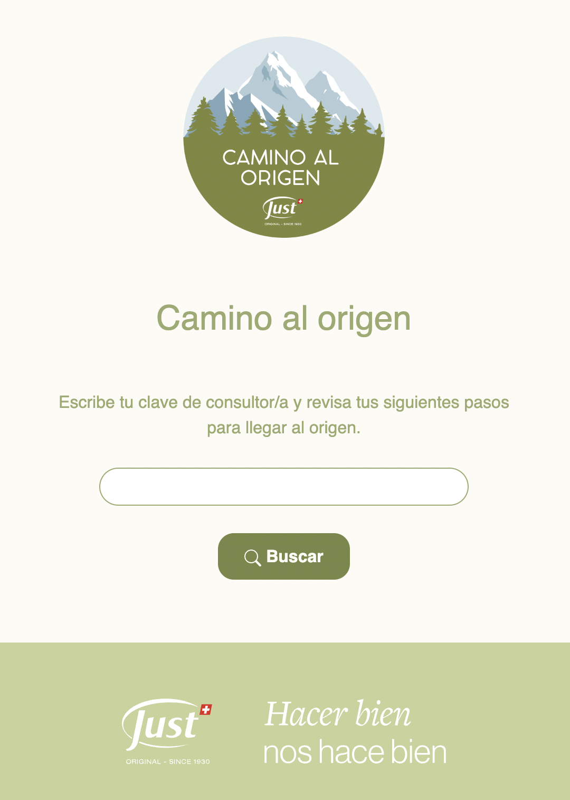
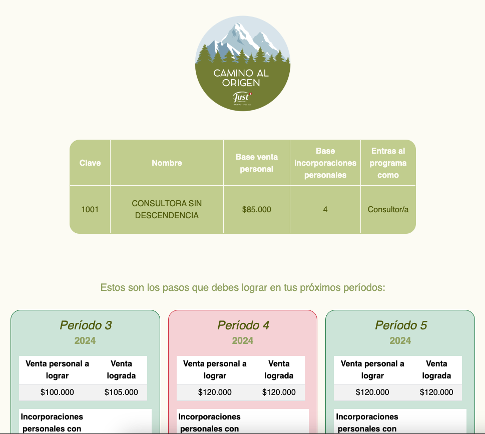
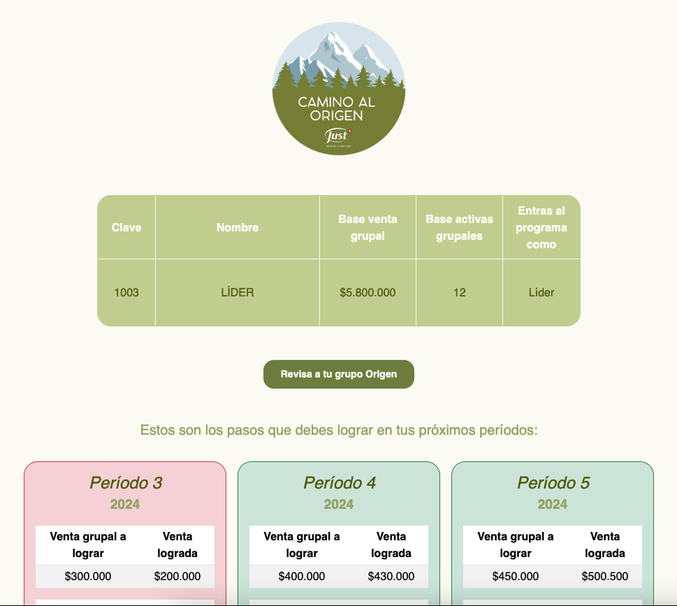
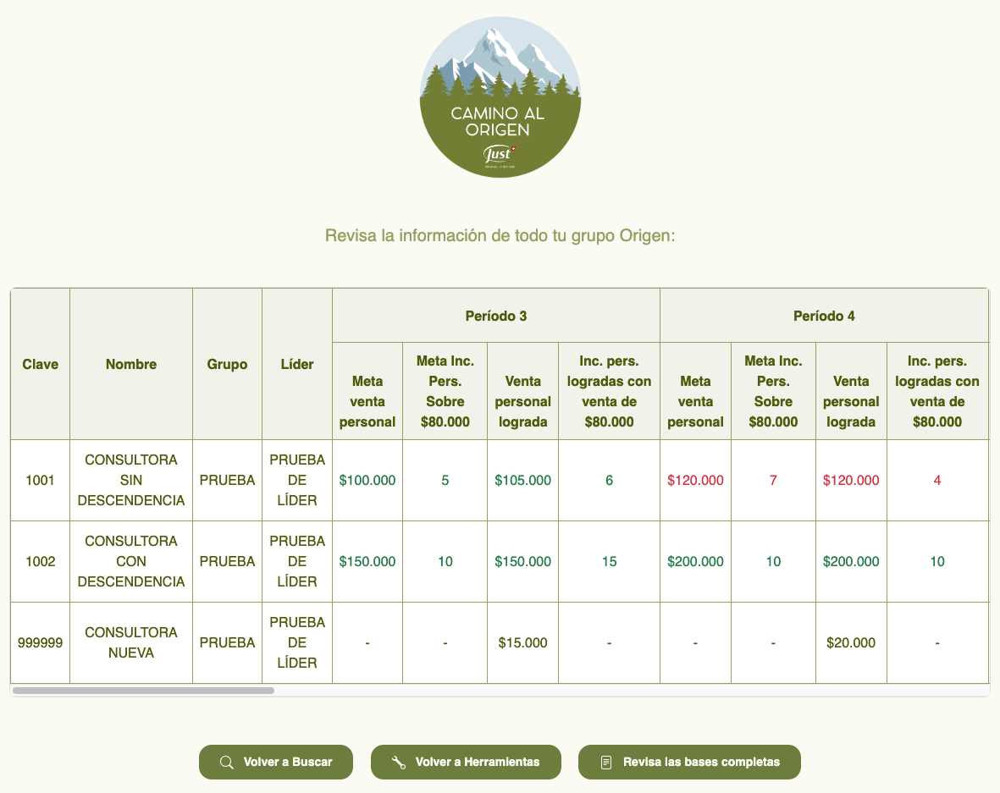

# Just - *Camino al origen*

---

###
### 🇪🇸 [Español](#esp) | 🇺🇸 [English](#eng)
###

---

## 🇪🇸 Español

Este es el repositorio de la página web de **_Just - Camino al origen_**.

Esta página se desarrolló como una herramienta para las consultoras, consultores y líderes de la
empresa [Just](https://www.just.cl/) para la promoción _"Camino al Origen"_, que consiste en el cumplimiento de metas de
ventas por períodos, para ganar un viaje a Suiza.
La página les permite acceder a los resultados mensuales de sus ventas e incorporaciones, así como a los resultados de
sus equipos y descendencia.

### Funcionalidades:

Consta de las siguientes funcionalidades:

- **Página de Bienvenida:** Incluye un formulario para buscar la información utilizando la clave de usuario.

- **Página de Resultados Personales:** Muestra los resultados personales del usuario, indicando mediante colores si se
  cumplió o no el objetivo para cada período.

- **Página de Resultados de la Descendencia:** Si el usuario tiene descendencia, se habilita un botón para que pueda ver
  sus resultados.

- **Página de Resultados del Equipo:** Si el usuario es un/una líder, se habilita un botón para ver los resultados de
  todo su grupo.

### Tecnologías Utilizadas

La página está desarrollada principalmente en HTML con el uso de Bootstrap para el diseño responsivo y PHP para la
lógica del backend, que se conecta a una base de datos MySQL.

 

### Diseño

El diseño de la página web se realizó en colaboración con el área de Marketing de Just, asegurándose de cumplir con los
estándares de la marca y proporcionar una experiencia visual atractiva y coherente.

#

---

## 🇺🇸 English

This is the repository for the **_Just - Path to Origin_** website.

This page was developed as a tool for the consultants, consultants, and leaders of the company [Just](https://www.just.cl/) for the "Path to Origin" promotion, which consists of meeting sales goals over periods, to win a trip to Switzerland. The page allows them to access the monthly results of their sales and incorporations, as well as the results of their teams and offspring.

### Features:

It consists of the following features:

- **Welcome Page:** Includes a form to search for information using the user's key.

- **Personal Results Page:** Displays the user's personal results, indicating by colors whether the goal was met for each period.

- **Offspring Results Page:** If the user has offspring, a button is enabled for them to see their results.

- **Team Results Page:** If the user is a leader, a button is enabled to view the results of their entire group.

### Technologies Used

The page is primarily developed in HTML with the use of Bootstrap for responsive design and PHP for backend logic, connecting to a MySQL database.

 

### Design

The design of the website was done in collaboration with the Marketing area of Just, ensuring compliance with brand standards and providing an attractive and consistent visual experience.
#

---

## Capturas de Pantalla / Screenshots
###

#